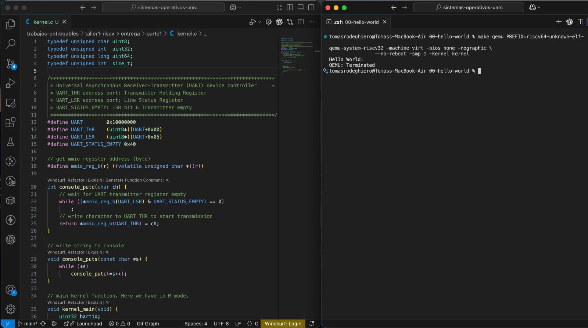

# Parte 1 – Entrega (Kernel mínimo en M-mode)

**Universidad Nacional de Río Cuarto**

**Sistemas Operativos (Código 1965) - Taller 1**

**Alumno:** Tomás Rodeghiero

**Abril de 2026**

En esta parte adjunto las siguientes evidencias:

- `kernel.c`, archivo de código fuente solicitado por la consigna.
- `00-qemu-output.txt`, salida del kernel al ejecutarlo en QEMU.
- `captura-parte1.jpeg`, captura con el kernel corriendo y `kernel.c`.
- `01-ejercicio1-nm.txt`, `03-ejercicio3-readelf.txt`, `04-ejercicio4-text-hexdump.txt`, `05-ejercicio5-rodata-hexdump.txt` con los ejercicios técnicos del README.

Captura incluida:



## Ubicación de carpetas (muy importante)

Dentro del proyecto:

- `00-hello-world/` contiene el binario `kernel`.
- `entrega/parte1/` contiene evidencias y este README.

## Comandos

```bash
cd 00-hello-world
make PREFIX=riscv64-unknown-elf-
make qemu PREFIX=riscv64-unknown-elf-

riscv64-unknown-elf-nm -n kernel > ../entrega/parte1/01-ejercicio1-nm.txt
riscv64-unknown-elf-readelf -at kernel > ../entrega/parte1/03-ejercicio3-readelf.txt
riscv64-unknown-elf-objdump -s -j .text kernel > ../entrega/parte1/04-ejercicio4-text-hexdump.txt
riscv64-unknown-elf-objdump -s -j .rodata kernel > ../entrega/parte1/05-ejercicio5-rodata-hexdump.txt
```

## Ejercicios resueltos del README de esta Parte 1

Comandos utilizados desde `/00-hello-world`:

### 1) Listado de símbolos con `nm`

```bash
riscv64-unknown-elf-nm -n kernel
```

Salida guardada en: `01-ejercicio1-nm.txt`.

Verificaciones:

- `boot` en `0x80000000`.
- `kernel_main` en `0x8000008c`.
- `__stack0` en `0x80001000`.
- `__kernel_end` en `0x80002000`.
- `__kernel_end - __stack0 = 0x1000` (4 KB), como pide la consigna.

Segunda columna de `nm`:

- `T`: símbolo en sección de código (`.text`).
- `R`: símbolo en sección de solo lectura.

### 2) Análisis de `kernel.asm`

Se identicó:

- `boot` inicializa stack y llama a `kernel_main`.
- `kernel_main` imprime `Hello World!` y entra en loop infinito.
- `console_puts` recorre la cadena y usa `console_putc`.
- `console_putc` espera UART lista (`UART_LSR`) y escribe en `UART_THR`.

### 3) Inspección ELF con `readelf`

```bash
riscv64-unknown-elf-readelf -at kernel
```

Salida guardada en: `03-ejercicio3-readelf.txt`.

Verificaciones:

- Tipo: `EXEC (Executable file)`.
- Máquina: `RISC-V`.
- Entry point: `0x80000000`.
- Secciones relevantes: `.text` y `.rodata`.

### 4) Contenido hexadecimal de `.text`

```bash
riscv64-unknown-elf-objdump -s -j .text kernel
```

Salida guardada en: `04-ejercicio4-text-hexdump.txt`.

### 5) Contenido hexadecimal de `.rodata`

```bash
riscv64-unknown-elf-objdump -s -j .rodata kernel
```

Salida guardada en: `05-ejercicio5-rodata-hexdump.txt`.

En esta sección se ve la cadena `"Hello World!\n"` en hexadecimal y ASCII.

### 6) Verificación de M-mode leyendo `mhartid`

En `kernel.c` se verifica con inline assembly de GCC:

```c
__asm__ __volatile__("csrr %0, mhartid" : "=r"(hartid));
```

`mhartid` es un CSR (_Control and Status Register_) de machine mode. Si la lectura se ejecuta correctamente, el código está corriendo en M-mode. Si se intentara leer desde S-mode, se produciría una excepción de instrucción ilegal (`scause = 2`).

Para volver a verificarlo en ejecución, se puede repetir:

```bash
make PREFIX=riscv64-unknown-elf-
make qemu PREFIX=riscv64-unknown-elf-
```

Si el kernel arranca e imprime `Hello World!` sin excepción, la lectura de `mhartid` se ejecutó correctamente y, en este paso, eso confirma M-mode.
